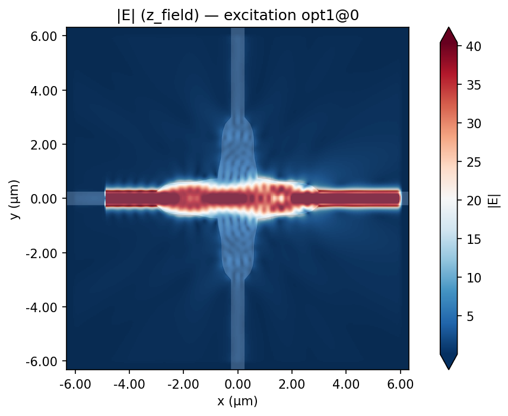
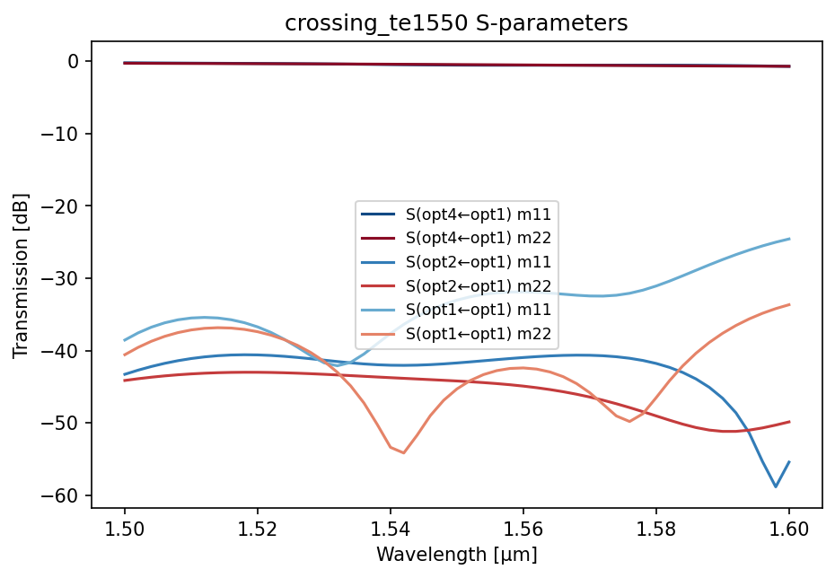
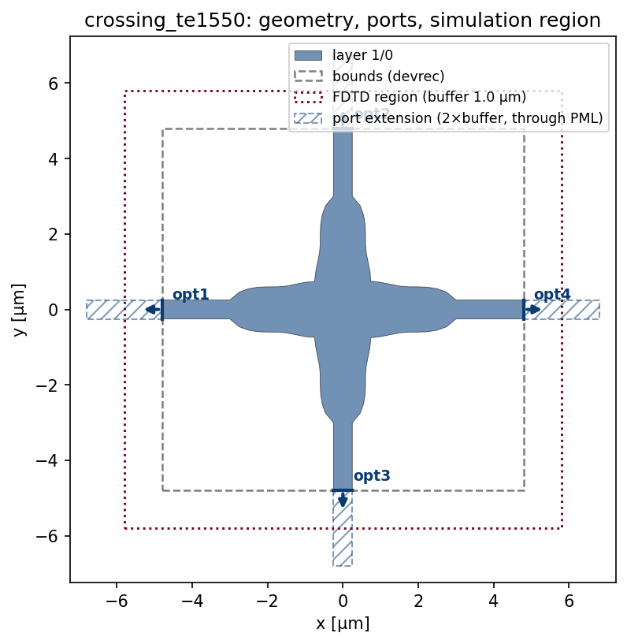
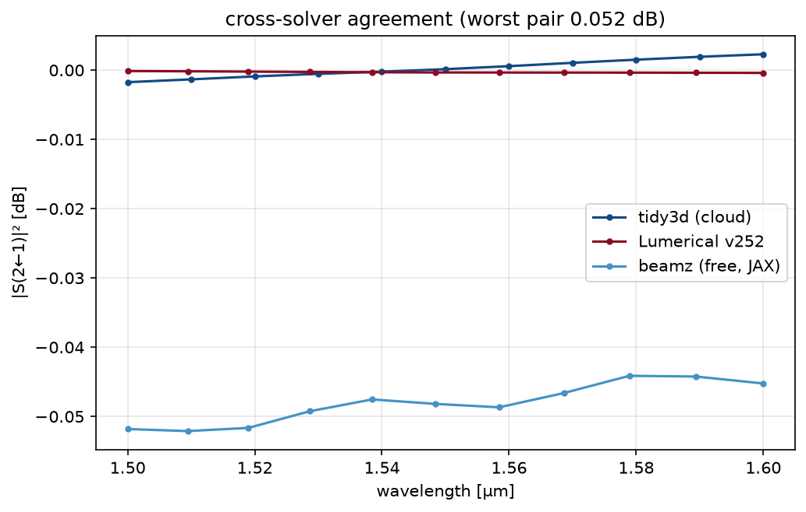

# gds_fdtd


[](https://github.com/SiEPIC/gds_fdtd/actions/workflows/ci.yml)
[](https://codecov.io/gh/siepic/gds_fdtd)
[](https://siepic.github.io/gds_fdtd/)
[](https://pypi.org/project/gds-fdtd/)
[](https://pypi.org/project/gds-fdtd/)
[](LICENSE)

**gds_fdtd** turns a photonic chip layout (GDS) into ready-to-run 3D FDTD simulations on the engine of your choice, and returns standardized S-parameters. EDA-agnostic on the front (KLayout/SiEPIC, gdsfactory), solver-agnostic on the back — one component, one technology file, any engine:

```python
solver = get_solver("tidy3d" | "lumerical" | "beamz")(component, tech, spec)
smatrix = solver.run()
```

| | |
|:---:|:---:|
|  |  |
| waveguide crossing on **tidy3d**, mesh 10 (`examples/03_tidy3d`) | thru / crosstalk / reflection per polarization, same run |
|  |  |
| every example starts with geometry + ports + FDTD region + port extensions | the IDENTICAL job on all three engines: tidy3d ↔ Lumerical within **0.003 dB**, free beamz within 0.05 dB |

*All images are real solver output produced by the examples as committed.*

## Features

- **Bring your own engine:** implement four methods and any FDTD engine plugs in with full S-matrix export, physics checks, caching, CLI, and a free conformance test suite — **[the guide: docs/adding_a_solver.md](docs/adding_a_solver.md)**.
- **Solver-agnostic engine registry:** `get_solver("tidy3d" | "lumerical" | "beamz")` — identical `(component, technology, SimulationSpec)` in, identical `SMatrix` out. Third-party engines plug in via entry points. `validate()`/`build()`/`estimate()` are always offline and free; only `run()` spends credits/licenses/compute.
- **Layout ingestion:** raw GDS via KLayout with SiEPIC pin/devrec conventions, [SiEPIC](https://github.com/SiEPIC/SiEPIC-Tools) PDK cells, and [gdsfactory](https://github.com/gdsfactory/gdsfactory) (>= 9) components — ports auto-detected, never hand-placed.
- **Validated technology files:** the layer stack is a pydantic-validated YAML (bad files fail with the offending key named). Materials can carry per-solver entries or a neutral [refractiveindex.info](https://refractiveindex.info) reference (`rii: {shelf, book, page}`), resolved offline from a local database copy.
- **Canonical S-matrix:** one `SMatrix` type with NaN-aware partial matrices, reciprocity/passivity/power-balance checks, and I/O to Lumerical INTERCONNECT `.dat`, Touchstone `.sNp` (scikit-rf compatible), HDF5/npz, plus plotting.
- **Cross-validated engines** (see [SOLVER_STATUS.md](SOLVER_STATUS.md) for per-engine last-verified dates): the tidy3d (>= 2.11, cloud) and Lumerical (2024/2025, local) adapters were validated live against each other on identical geometry (< 0.15 dB agreement, locked into CI via recorded artifacts). [beamz](https://github.com/beamzorg/beamz) provides a fully open-source, zero-cost local engine (JAX, CPU/GPU).
- **Multimode/dual-polarization** simulations on the engines that support them (tidy3d, Lumerical).
- **Serializable jobs + CLI:** every simulation is a JSON `JobSpec`; `gds-fdtd validate|build|estimate|run|convert|solvers` drives it from the shell, and `SubprocessBackend` runs sweeps crash-isolated and in parallel. Secrets stay in the environment — job files are safe to ship to a cluster or cloud runner ([docs/remote_compute.md](docs/remote_compute.md)).
- **Convergence sweeps, caching, cross-solver validation:** `convergence.sweep()` steps any `SimulationSpec` field and recommends the converged value; `run_cached()` hashes the full job (geometry + technology + spec + engine version) so repeat runs are free; `validation.validate_across()` quantifies worst-case |ΔS| between engines on the same job.

## Supported solvers

| engine | execution | cost | install |
|---|---|---|---|
| [Tidy3D](https://github.com/flexcompute/tidy3d) >= 2.11 | cloud | FlexCredits | `pip install gds_fdtd[tidy3d]` |
| Ansys Lumerical FDTD 2024/2025 | local | license | Lumerical install + `lumapi` on path |
| [beamz](https://github.com/beamzorg/beamz) >= 0.4 | local (JAX, CPU/GPU) | free | `pip install gds_fdtd[beamz]` |

## Examples

| example | shows |
|---|---|
| `01_basics/` | GDS -> tidy3d via the modern solver API (offline build, cloud run) |
| `02_lumerical/`, `03_tidy3d/` | the SAME flow on Lumerical / tidy3d — 02b and 03b are identical code except the engine string (+ mesh convergence via `convergence.sweep`) |
| `04_solvers/` | the engine-agnostic registry (04a); convergence sweeps + job caching (04b); cross-solver validation on recorded real results, runs offline (04c) |
| `05_gdsfactory/` | gdsfactory >= 9 conversion -> any solver |
| `06_beamz/` | the open-source zero-cost engine — identical setup, no license, no credits |
| `07_prefab/` | lithography-predicted geometry ([PreFab](https://github.com/PreFab-Photonics/PreFab)) |
| `08_siepic/` | SiEPIC EBeam PDK cells on tidy3d / Lumerical |
| `09_smatrix/` | SMatrix I/O: .dat/Touchstone/HDF5, physics checks, plotting (runs offline on recorded real data) |
| `10_materials/` | validated technology YAML + refractiveindex.info materials |

## Installation

You can install `gds_fdtd` using the following options:

### Quick install (PyPI)

```bash
pip install gds-fdtd
```

### Option: Basic Installation from source

To install the core functionality of `gds_fdtd`, clone the repository and install using `pip`:

```bash
git clone git@github.com:mustafacc/gds_fdtd.git
cd gds_fdtd
pip install -e .
```

### Option: Development Installation

For contributing to the development or if you need testing utilities, install with the dev dependencies:

```bash
git clone git@github.com:mustafacc/gds_fdtd.git
cd gds_fdtd
pip install -e .[dev]
```

This will install additional tools like `pytest` and `coverage` for testing.

### Editable + dev tools

```bash
pip install -e .[dev]
```

### Optional extras

| extra      | purpose                        | install command                             |
|------------|--------------------------------|---------------------------------------------|
| tidy3d     | [Tidy3D](https://github.com/flexcompute/tidy3d) cloud solver (>= 2.11)   | `pip install -e .[tidy3d]`                  |
| beamz      | [beamz](https://github.com/beamzorg/beamz) open-source JAX solver        | `pip install -e .[beamz]`                   |
| gdsfactory | [GDSFactory](https://github.com/gdsfactory/gdsfactory) (>= 9) EDA support | `pip install -e .[gdsfactory]`              |
| siepic     | [SiEPIC](https://github.com/SiEPIC/SiEPIC-Tools) EDA support             | `pip install -e .[siepic]`                  |
| prefab     | [PreFab](https://github.com/PreFab-Photonics/PreFab) lithography prediction | `pip install -e .[prefab]`                |
| everything | dev tools + all plugins        | `pip install -e .[dev,tidy3d,beamz,gdsfactory,prefab,siepic]` |

(Lumerical needs no extra: the adapter finds `lumapi` from the local installation.)

### Requirements

- Python ≥ 3.11
- Runtime deps: numpy, matplotlib, shapely, PyYAML, klayout


### Running tests

If you've installed the `dev` dependencies, you can run the test suite with:

```bash
pytest --cov=gds_fdtd tests
```

## Development

### Development Setup

```bash
git clone https://github.com/SiEPIC/gds_fdtd.git
cd gds_fdtd
pip install -e .[dev]        # or: uv sync --extra dev

# install the git hooks (uses the standard .pre-commit-config.yaml;
# prek is a fast drop-in for pre-commit)
uv tool install prek && prek install
```

Canonical dev tasks live in the [justfile](justfile):

```bash
just test        # tests with coverage
just lint        # ruff check + format check (what CI runs)
just fix         # auto-fix lint + formatting
just docs        # build documentation
just gate        # quick lint+test gate
```

### Versioning & Releases

The version is derived **from git tags** via `hatch-vcs` — there is nothing to bump and no
version string in the source. To release:

```bash
git tag v0.5.0
git push --tags
```

The `release.yml` workflow then verifies the tagged commit passed CI, builds and inspects the
package, publishes to PyPI via Trusted Publishing (with PEP 740 attestations), and creates a
GitHub Release with auto-generated notes (categorized by PR labels — see
`.github/release.yml`).
