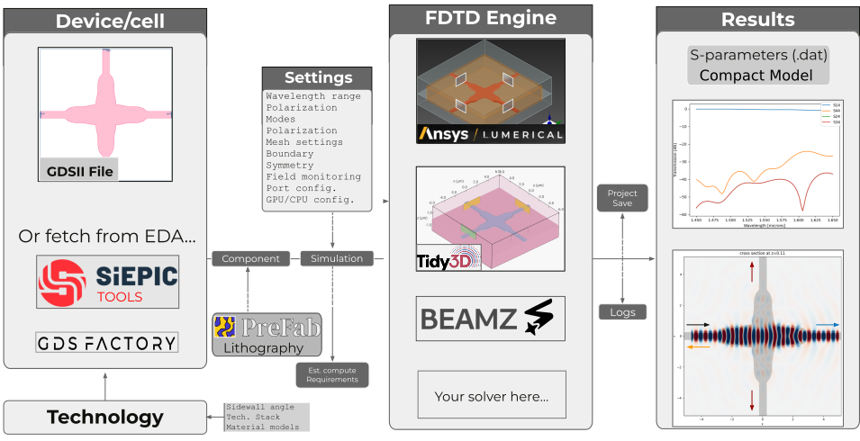
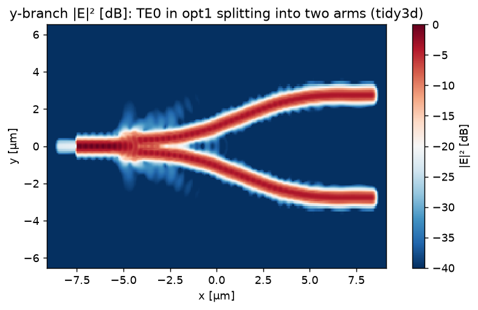
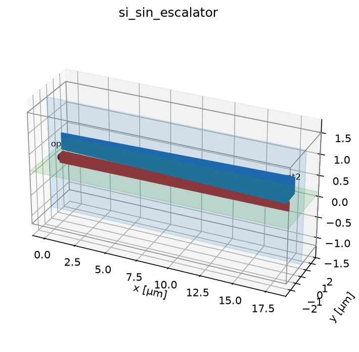

# gds_fdtd



[](https://github.com/SiEPIC/gds_fdtd/actions/workflows/ci.yml)
[](https://codecov.io/gh/siepic/gds_fdtd)
[](https://siepic.github.io/gds_fdtd/)
[](https://pypi.org/project/gds-fdtd/)
[](https://pypi.org/project/gds-fdtd/)
[](LICENSE)
[](https://scorecard.dev/viewer/?uri=github.com/SiEPIC/gds_fdtd)

**EDA- and solver-agnostic 3D FDTD simulation framework for photonic layouts: GDS in, S-parameters, fields, and compact models out - tidy3d, Lumerical, or beamz behind one API.**

One component, one technology file, one `SimulationSpec`, any engine: EDA-agnostic on the front (KLayout/SiEPIC, gdsfactory, raw GDS), solver-agnostic on the back. Beyond the S-matrix you also get field and mode visualizations, physics checks (reciprocity/passivity), mesh-convergence and cross-engine validation, and one-call export to compact-model formats (Touchstone `.sNp`, Lumerical INTERCONNECT `.dat`, HDF5) for circuit simulation.

```python
solver = get_solver("tidy3d" | "lumerical" | "beamz")(component, tech, spec)
smatrix = solver.run()
```

| | |
|:---:|:---:|
|  |  |
| a waveguide crossing on **tidy3d** (log-scale field): TE0 goes straight through, with the faint crosstalk into the side arms visible | its S-parameters (51 λ, TE + TM): −0.5 dB insertion loss, −41 dB crosstalk, −33 dB reflection |
|  |  |
| a y-branch splitter (log-scale field): one input mode splitting evenly into two arms | the IDENTICAL job on all three engines: tidy3d and Lumerical within **0.003 dB**, free beamz within 0.05 dB |

*All images are real solver output.*

## See your problem before you run it

Every solver setup renders as an interactive 3D scene — the layer stack with
per-layer colors, port cones, field-monitor planes, and the domain box.
Orbit, zoom, click an object for its material and z-extent, toggle groups
from the legend. **[Play with it live in the docs](https://siepic.github.io/gds_fdtd/_notebooks/05b_field_monitors.html)**
(also embedded in examples 01 and 11):



```python
from gds_fdtd.viewer3d import show_3d
show_3d(solver)   # notebooks + docs; save_3d(...) writes a shareable page
```

## Features

- **Bring your own engine:** implement four methods and any FDTD engine plugs in with full S-matrix export, physics checks, caching, CLI, and a free conformance test suite — **[the guide: docs/adding_a_solver.md](docs/adding_a_solver.md)**.
- **Solver-agnostic engine registry:** `get_solver("tidy3d" | "lumerical" | "beamz")` — identical `(component, technology, SimulationSpec)` in, identical `SMatrix` out. Third-party engines plug in via entry points. `validate()`/`build()`/`estimate()` are always offline and free; only `run()` spends credits/licenses/compute.
- **Layout ingestion:** raw GDS via KLayout with SiEPIC pin/devrec conventions, [SiEPIC](https://github.com/SiEPIC/SiEPIC-Tools) PDK cells, and [gdsfactory](https://github.com/gdsfactory/gdsfactory) (>= 9) components — ports auto-detected, never hand-placed.
- **Validated technology files:** the layer stack is a pydantic-validated YAML (bad files fail with the offending key named). Materials can carry per-solver entries or a neutral [refractiveindex.info](https://refractiveindex.info) reference (`rii: {shelf, book, page}`), resolved offline from a local database copy.
- **Canonical S-matrix:** one `SMatrix` type with NaN-aware partial matrices, reciprocity/passivity/power-balance checks, and I/O to Lumerical INTERCONNECT `.dat`, Touchstone `.sNp` (scikit-rf compatible), HDF5/npz, plus plotting.
- **Cross-validated engines** (see [SOLVER_STATUS.md](SOLVER_STATUS.md) for per-engine last-verified dates): the tidy3d (>= 2.11, cloud) and Lumerical (2024/2025, local) adapters were validated live against each other on identical geometry — within **0.0033 dB**, with the free [beamz](https://github.com/beamzorg/beamz) engine (JAX, CPU/GPU) inside 0.052 dB of both; the agreement is locked into CI via recorded artifacts.
- **Interactive 3D viewer:** `show_3d(solver)` renders the extruded layer stack, ports, field-monitor planes, and simulation domain as an orbitable, clickable three.js scene — in notebooks and in the [documentation gallery](https://siepic.github.io/gds_fdtd/_notebooks/05b_field_monitors.html) alike; `render_static` draws the same scene without JavaScript.
- **Multimode/dual-polarization** simulations on the engines that support them (tidy3d, Lumerical).
- **Serializable jobs + CLI:** every simulation is a JSON `JobSpec`; `gds-fdtd validate|build|estimate|run|convert|solvers` drives it from the shell, and `SubprocessBackend` runs sweeps crash-isolated and in parallel. Secrets stay in the environment — job files are safe to ship to a cluster or cloud runner ([docs/remote_compute.md](docs/remote_compute.md)).
- **Convergence sweeps, caching, cross-solver validation:** `convergence.sweep()` steps any `SimulationSpec` field and recommends the converged value; `run_cached()` hashes the full job (geometry + technology + spec + engine version) so repeat runs are free; `validation.validate_across()` quantifies worst-case |ΔS| between engines on the same job.

## Supported solvers

| engine | execution | cost | install |
|---|---|---|---|
| [Tidy3D](https://github.com/flexcompute/tidy3d) >= 2.11 | cloud | FlexCredits | `pip install gds_fdtd[tidy3d]` |
| Ansys Lumerical FDTD 2024/2025 | local | license | Lumerical install + `lumapi` on path |
| [beamz](https://github.com/beamzorg/beamz) >= 0.4 | local (JAX, CPU/GPU) | free | `pip install gds_fdtd[beamz]` |

## Examples

A guided path from *"load a layout"* to *"run it on any engine and read the
S-parameters"* — paired `.py` (jupytext) + executed `.ipynb`. See
[examples/README.md](examples/README.md) for the full tour.

| # | example | shows | engine |
|---|---|---|---|
| 00 | `00_quickstart/` | layout → S-matrix in ten lines | beamz (free) |
| 01 | `01_layout_to_component/` | load a GDS / gdsfactory cell, auto-detect ports, read the geometry | none |
| 02 | `02_technology/` | materials, `refractiveindex.info` vs shipped models, the vertical layer stack | none |
| 02b | `02_technology/` | feed one `refractiveindex.info` model (full complex `n+ik`) into every engine | tidy3d-local + recorded |
| 03 | `03_first_simulation/` | the full flow end-to-end: geometry → permittivity → build → run → S-params → fields | beamz (free) |
| 04 | `04_reading_results/` | `SMatrix`: insertion loss, crosstalk, phase, reciprocity/passivity, Touchstone/HDF5/npz I/O | none |
| 05 | `05_fields_and_modes/` | waveguide mode profiles, effective indices, permittivity cross-sections | tidy3d-local (free) |
| 05b | `05_fields_and_modes/` | field monitors: axes, pinned positions, recorded wavelengths, `plot_monitor_planes`; the escalator side view | recorded (tidy3d) |
| 06 | `06_convergence_and_caching/` | mesh-convergence sweeps, `run_cached` (repeat runs free), and cross-engine validation where *converged ≠ correct* | beamz + recorded |
| 07 | `07_choosing_an_engine/` | the identical job on beamz / tidy3d / Lumerical, and how they agree | all three |
| 08 | `08_frontends/` | any EDA in, any engine out: gdsfactory / SiEPIC / raw-GDS frontends, then the frontend × engine matrix | mixed |
| 09 | `09_cli_and_jobs/` | the `gds-fdtd` CLI and serializable `JobSpec` for remote/batch compute | none |
| 10 | `10_cookbook/` | reference devices with known-good S-params — the **Si→SiN escalator** on the free engine, cross-checked against recorded tidy3d/Lumerical | beamz + recorded |
| 10b | `10_cookbook/` | polarization splitter and splitter-rotator from gdsfactory: TE/TM modes, multi-mode S-params, per-polarization fields | recorded (2 engines) |
| 11 | `11_bragg_grating/` | a 95 µm Bragg grating: stopband spectrum + the field reflecting in-band and passing out-of-band | recorded (tidy3d) |

## Installation

```bash
pip install gds-fdtd            # core
pip install "gds-fdtd[all]"     # + every engine and layout frontend
```

From source, editable:

```bash
git clone https://github.com/SiEPIC/gds_fdtd.git && cd gds_fdtd
pip install -e ".[all]"         # everything, editable
pip install -e ".[all,dev]"     # + test and lint tools, for contributing
```

**Lumerical** needs no extra; the adapter finds `lumapi` from your local Lumerical install.

To pick plugins individually, each is its own extra:

| extra | adds |
|---|---|
| `tidy3d` | [Tidy3D](https://github.com/flexcompute/tidy3d) cloud solver |
| `beamz` | [beamz](https://github.com/beamzorg/beamz) open-source JAX solver |
| `gdsfactory` | [gdsfactory](https://github.com/gdsfactory/gdsfactory) frontend |
| `siepic` | [SiEPIC](https://github.com/SiEPIC/SiEPIC-Tools) / KLayout frontend |
| `prefab` | [PreFab](https://github.com/PreFab-Photonics/PreFab) lithography prediction |
| `engines` | tidy3d + beamz |
| `all` | every plugin above |
| `dev` | test and lint tooling (for contributing) |

Requires Python ≥ 3.11; core runtime deps (numpy, matplotlib, shapely, PyYAML, klayout, pydantic) install automatically.


### Running tests

If you've installed the `dev` dependencies, you can run the test suite with:

```bash
pytest --cov=gds_fdtd tests
```

## Development

### Development Setup

```bash
git clone https://github.com/SiEPIC/gds_fdtd.git
cd gds_fdtd
pip install -e .[dev]        # or: uv sync --extra dev

# install the git hooks (uses the standard .pre-commit-config.yaml;
# prek is a fast drop-in for pre-commit)
uv tool install prek && prek install
```

Canonical dev tasks live in the [justfile](justfile):

```bash
just test        # tests with coverage
just lint        # ruff check + format check (what CI runs)
just fix         # auto-fix lint + formatting
just docs        # build documentation
just gate        # quick lint+test gate
```

### Versioning & Releases

The version is derived **from git tags** via `hatch-vcs` — there is nothing to bump and no
version string in the source. To release:

```bash
git tag v0.6.0
git push --tags
```

The `release.yml` workflow then verifies the tagged commit passed CI, builds and inspects the
package, publishes to PyPI via Trusted Publishing (with PEP 740 attestations), and creates a
GitHub Release with auto-generated notes (categorized by PR labels — see
`.github/release.yml`).
