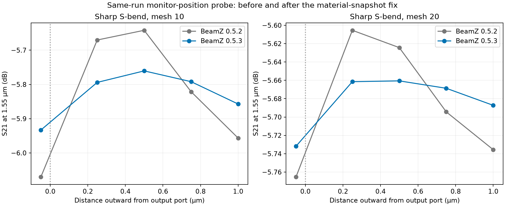

# BeamZ 0.5.3: verification of the issue #309 fix

BeamZ 0.5.3's material-snapshot correction works through GDS_FDTD. The exact
same-run S-bend probes show substantially less monitor-position dependence.
This verifies the effect of the upstream correction; it does not establish
absolute mesh convergence or eliminate all numerical sensitivity.

The fix in [BeamZ PR #310](https://github.com/beamzorg/beamz/pull/310) preserves
the material tensor and Yee coefficients used during propagation when
performing detached 3D modal analysis. No GDS_FDTD solver implementation change
was needed. The dependency lock now selects the released 0.5.3 package.
All 0.5.2 artifacts are preserved unchanged.

## Controlled monitor-position probes

Same source, input monitor, geometry, aperture, frequencies, and stopping
criteria as the original [issue #309](https://github.com/beamzorg/beamz/issues/309)
reproducer. The mesh-10 run uses the standalone native BeamZ artifact; mesh 20
uses the GDS_FDTD geometry builder through `beamz_port_probe.py`.

The spread is max minus min S21 magnitude in dB across four monitors along
the uniform output lead, excluding the fifth plane inside the bend.

| Mesh | 0.5.2 spread at 1.55 µm | 0.5.3 spread at 1.55 µm | Reduction |
|---|---:|---:|---:|
| 10 | 0.314585 dB | 0.096661 dB | 69.3% |
| 20 | 0.130121 dB | 0.026648 dB | 79.5% |

Across the three sampled wavelengths (1.60, 1.55, 1.50 µm), the 0.5.3 spread
is 0.0696–0.1024 dB at mesh 10 and 0.0204–0.0346 dB at mesh 20. Both probes
reach the temporal stopping criterion. The mesh-10 propagation termination
statistics are identical between versions, consistent with a modal analysis
correction rather than altered propagation.



[Vector plot](results/beamz-0.5.3-validation/monitor_comparison.svg) ·
[Numeric summary](results/beamz-0.5.3-validation/summary.json)

The default adapter monitor lies 0.05 µm inside the bend. It is displayed in
the figure but excluded from the uniform-lead spread. Its different result
remains a reason to assess port placement for quantitative bend-loss work;
no source or monitor offset was tuned to match commercial reference values.

## Full GDS_FDTD device checks

Transmission at 1.55 µm in dB, interpolated in frequency where needed.
The S-bend references use the finest available recorded meshes.

| Device / path | BeamZ 0.5.2 | BeamZ 0.5.3 | Recorded Tidy3D | Recorded Lumerical |
|---|---:|---:|---:|---:|
| escalator, mesh 10, S21 | +0.032 | +0.030 | +0.019 | -0.055 |
| sbend, mesh 10, S21 | -6.063 | -5.925 | -5.635 | -5.633 |
| sbend, mesh 20, S21 | -5.764 | -5.731 | -5.635 | -5.633 |
| ybranch, mesh 10, S21 | -3.170 | -3.168 | -3.204 | -3.202 |
| ybranch, mesh 10, S31 | -3.158 | -3.157 | -3.204 | -3.202 |

All nine excitations in these four full-matrix runs produced finite results
and reached the temporal stopping criterion. Every source's incident-power
mask is valid at every sampled frequency. Saved geometry hashes, specifications,
grids, and port definitions match the corresponding 0.5.2 runs exactly.

Y-branch reverse transmission remains valid: S12 =
-3.128 dB and S13 =
-3.143 dB. Weak output-arm coupling remains
about -24.1 dB, versus -26.4 dB for Tidy3D and -33.4 dB for Lumerical.
The material-snapshot fix does not eliminate those cross-engine differences.

Escalator S12 = -0.064 dB; its maximum
guided-power sum is 1.010148. Any small positive
transmission/power excess is numerical error, not physical gain.

## Merge scope and remaining accuracy work

The specific modal-analysis defect is corrected and the released fix is verified
in this integration. The existing evidence supports merging this adapter
migration after normal CI and review, with BeamZ >=0.5.3 required. Additional
physics benchmarks are not a prerequisite for this limited compatibility and
regression-improvement claim. PR #154 remains draft until maintainer review.

This is not a claim of uniform improvement in every matrix entry: the dominant
S-bend defect is reduced, y-branch forward/reverse paths remain healthy, and
escalator transmission is stable, while weak reflections/coupling still differ.
The 0.5.3 default S-bend S21 changes by about 0.194 dB between meshes 10 and 20,
so the current pair cannot establish mesh convergence. No source/monitor
placement changes were introduced.

For a stronger quantitative-accuracy claim, prioritize these follow-ups:

1. Extend the **0.5.3 S-bend sweep to meshes 25 and 30**, comparing successive
   refinements and recorded references. Repeat the same-run uniform-lead probes;
   keep the default-plane result visible rather than selecting a matching plane.
2. Run the **0.5.3 y-branch and escalator at meshes 14 and 20**, checking the full
   spectrum and every matrix column for transmission, reciprocity, and power
   balance. Earlier 0.5.2 coarse runs do not establish 0.5.3 mesh convergence.
3. For accurate **weak reflection/crosstalk or phase**, independently vary monitor
   aperture, straight-lead length, and PML clearance and align reference planes
   and material/geometry assumptions across engines. More forward-transmission
   agreement alone cannot validate these quantities.

Choose tolerances before those studies (for example, a design may require
successive through-loss changes below 0.05 dB); a numerical stopping criterion
is not an accuracy target. These are follow-up studies, not newly certified
capabilities. TM, multimode, and y-facing ports remain outside the validated
adapter scope.

## Reproduce

From the existing CUDA-enabled project environment:

```bash
uv pip install 'beamz==0.5.3'
mkdir -p benchmarks/results/beamz-0.5.3-validation
JAX_PLATFORMS=cuda XLA_PYTHON_CLIENT_PREALLOCATE=false MPLBACKEND=Agg \
  .venv/bin/python benchmarks/repro/beamz_plane_dependence.py --mesh 10 \
  --output benchmarks/results/beamz-0.5.3-validation/native-probe-mesh10.json
JAX_PLATFORMS=cuda XLA_PYTHON_CLIENT_PREALLOCATE=false MPLBACKEND=Agg \
  .venv/bin/python benchmarks/beamz_port_probe.py --mesh 20 \
  --output benchmarks/results/beamz-0.5.3-validation/sbend-plane-probe-mesh20
JAX_PLATFORMS=cuda XLA_PYTHON_CLIENT_PREALLOCATE=false MPLBACKEND=Agg \
  .venv/bin/python benchmarks/beamz_devices.py sbend --mesh 20 \
  --output benchmarks/results/beamz-0.5.3-validation/sbend-mesh20
MPLBACKEND=Agg .venv/bin/python benchmarks/compare_beamz_053.py
```

Repeat the device command with `sbend --mesh 10`, `ybranch --mesh 10`, or
`escalator --mesh 10`, using matching separate output directories. The y-branch
uses the same SiEPIC EBeam PDK 0.4.53 as the 0.5.2 validation.

The local RTX 3090 runs retain complete S-matrices, fields, raw modal amplitudes,
incident-power masks, and termination diagnostics. The validation suite passed
with 369 tests and 27 skips; it includes the local straight-waveguide end-to-end
regression. No cloud or licensed tests were run. Commercial comparisons use
existing recordings; their discretization/material/geometry limitations remain
as described in the [0.5.2 report](DEVICE_RESULTS.md).
