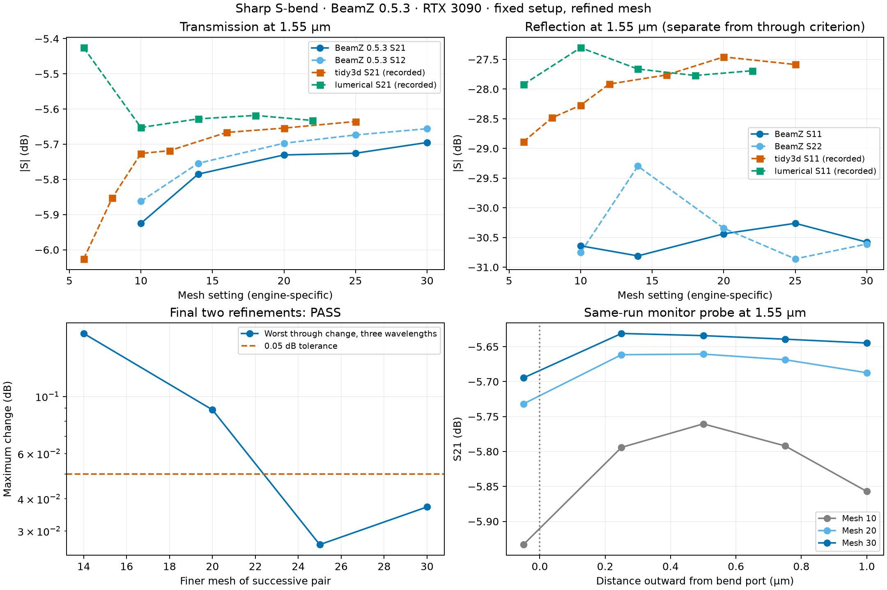

# BeamZ 0.5.3 S-bend mesh-convergence study

**The through-path mesh criterion passes** on the local RTX 3090 at the declared **0.05 dB** tolerance.
The final refinement changes are 0.02655 dB
(mesh 20→25) and 0.03720 dB (25→30),
taking the worst change across both transmission directions and all three
sampled wavelengths. This is a magnitude-convergence statement for these
sampled through paths, not certification of the entire S-matrix or all devices.

The reviewer requested a study following
[example 06](../examples/06_convergence_and_caching/06_convergence_and_caching.ipynb).
We reuse the completed 0.5.3 meshes 10/20 and run fresh meshes 14/25/30,
plus a same-run five-plane probe at mesh 30. All measurements use BeamZ 0.5.3
and JAX 0.10.2 on the RTX 3090. No commercial engine was rerun.



[Vector figure](results/beamz-0.5.3-convergence/convergence.svg) ·
[Numeric summary](results/beamz-0.5.3-convergence/summary.json) ·
[Analysis script](beamz_mesh_convergence.py)

## Method and declared acceptance criterion

Keep the GDS geometry, technology, domain, source/monitor offsets, and all
non-mesh simulation settings fixed. The analysis asserts equal geometry hashes,
ports, non-mesh specifications, wavelength samples, and BeamZ version before
comparing runs. Physical raster alignment and time step change with resolution.
The mesh-30 device and probe use JAX's `platform` allocator to avoid retaining
unused GPU allocations; this does not change the physical setup. The device
run logged a failed 7.52 GiB allocation when starting its second excitation,
then continued and exited successfully with complete, finite results and
valid stopping/source diagnostics. See [execution notes](results/beamz-0.5.3-convergence/execution_notes.json).

Before examining the fine-grid results, the criterion was set to **both final
successive refinement steps below 0.05 dB**, using the notebook's magnitude
comparison with `floor_db=-10`. Both through paths lie above that floor;
reflections are reported separately. The JSON implementation was checked against
`gds_fdtd.convergence.max_delta_db` using locally generated complex S-matrices.
Those checks agreed within 1e-10 dB. No complex phase was reconstructed from JSON.

The three actual wavelength samples are 1.600000,
1.548387, and 1.500000 µm. The 1.55 µm
values below are interpolated in frequency in dB; the successive-change test
uses all three original samples. Temporal termination is a separate check.
All device/probe runs reached the temporal stopping criterion, and all source
incident-power masks were valid.

## Fixed-plane device results

Values are 20 log10 |S| in dB at 1.55 µm. The adapter's default output monitor
remains 0.05 µm inside the bend; it was not moved to improve agreement.

| Mesh | Cell size (nm) | Cells | S21 (dB) | S12 (dB) | S11 (dB) |
|---:|---:|---:|---:|---:|---:|
| 10 | 44.591 | 2,908,582 | -5.92485 | -5.86226 | -30.64000 |
| 14 | 31.851 | 7,937,600 | -5.78504 | -5.75425 | -30.80977 |
| 20 | 22.296 | 23,170,060 | -5.73050 | -5.69722 | -30.43737 |
| 25 | 17.837 | 45,253,557 | -5.72568 | -5.67367 | -30.26096 |
| 30 | 14.864 | 78,088,032 | -5.69511 | -5.65601 | -30.57810 |

| Refinement | Worst through change (dB) | Below 0.05 dB? | All-entry change, −40 dB floor (dB) |
|---|---:|---|---:|
| 10 → 14 | 0.17567 | Fail | 2.48032 |
| 14 → 20 | 0.08872 | Fail | 1.05972 |
| 20 → 25 | 0.02655 | Pass | 0.53283 |
| 25 → 30 | 0.03720 | Pass | 0.50777 |

The 0.05 dB criterion bounds successive changes, not the absolute error.
The final change increases slightly from the preceding change; this study
does not extrapolate an asymptotic solution or claim monotonic error decay.

The all-entry metric includes weak reflections. It is deliberately shown beside
the through-path criterion so a small transmission change is not mistaken for
convergence of every S-parameter. Full matrix magnitudes, complex reciprocity
error, and guided-power sums are retained in the JSON records.

The finest recorded Tidy3D S21 is -5.63544 dB;
Lumerical is -5.63251 dB. The mesh-30 BeamZ S21
is -5.69511 dB, differing by
0.05968 and
0.06260 dB respectively.
Cross-engine agreement is separate from successive-mesh stability. Engine mesh
settings are not equivalent, and recorded models differ in discretization,
material/sidewall assumptions, and reference-plane details.

## Finest-grid monitor-position check

The source and input monitor stay fixed while five output monitors sample the
same simulation. Four planes lie 0.25/0.50/0.75/1.00 µm outward along the uniform
lead; the fifth lies 0.05 µm inside the bend. The spread below excludes the plane
inside the bend and is max minus min S21 in dB across the four lead planes.
These probes sample the same physical output; their powers must not be summed.

| Mesh | Spread at 1.60 µm (dB) | At 1.55 µm (dB) | At 1.50 µm (dB) |
|---:|---:|---:|---:|
| 10 | 0.06958 | 0.09666 | 0.10244 |
| 20 | 0.02043 | 0.02665 | 0.03461 |
| 30 | 0.00904 | 0.01371 | 0.01752 |

Mesh 30 is below 0.05 dB at all three probe wavelengths. This is a separate
monitor-sensitivity check, not a replacement for the default-plane mesh sweep.
At 1.55 µm, all four uniform-lead measurements range from -5.63109 to
-5.64479 dB, within 0.013 dB of both recorded references. The plane inside
the bend reads -5.69467 dB in the same run. These distinct locations should
not be treated as interchangeable, and no favorable plane was selected for
the primary fixed-plane convergence test.

The pre-existing BeamZ warning about material variation normal to the PML is
retained. This fixed-boundary study does not establish PML/domain convergence.
It also does not validate complex phase, TM, multimode, y-facing ports, or weak
crosstalk in other devices. The y-branch and escalator still need their own
same-version fine-mesh studies for equivalent convergence claims.

## Reproduce

Use the existing CUDA-enabled environment with BeamZ 0.5.3. The completed
mesh-10/20 measurements remain under `results/beamz-0.5.3-validation/`.
Run the new simulations in fresh interpreters:

```bash
export JAX_PLATFORMS=cuda
export XLA_PYTHON_CLIENT_PREALLOCATE=false
export MPLBACKEND=Agg
for mesh in 14 25; do
  .venv/bin/python benchmarks/beamz_devices.py sbend --mesh "$mesh" \
    --output "benchmarks/results/beamz-0.5.3-convergence/sbend-mesh$mesh"
done
XLA_PYTHON_CLIENT_ALLOCATOR=platform .venv/bin/python benchmarks/beamz_devices.py \
  sbend --mesh 30 --output benchmarks/results/beamz-0.5.3-convergence/sbend-mesh30
XLA_PYTHON_CLIENT_ALLOCATOR=platform .venv/bin/python benchmarks/beamz_port_probe.py \
  --mesh 30 --output benchmarks/results/beamz-0.5.3-convergence/sbend-plane-probe-mesh30
.venv/bin/python benchmarks/beamz_mesh_convergence.py
```

Only JSON measurements and selected comparison plots are committed. Solver
scripts also generate local complex matrices, modal archives, fields, and
preview images; those outputs are ignored by Git.
