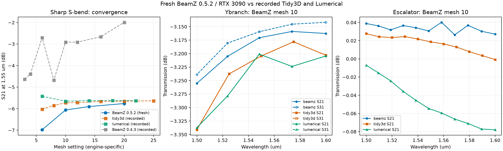
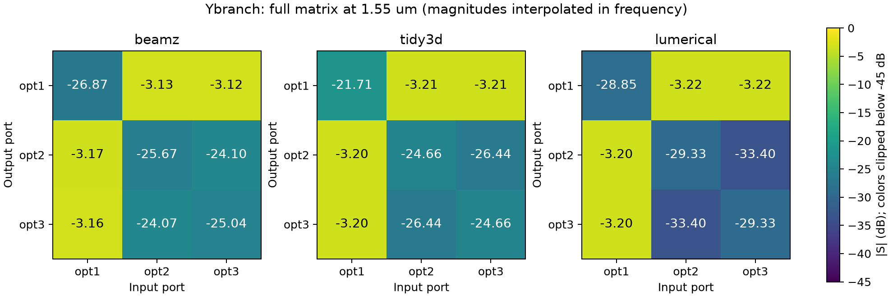
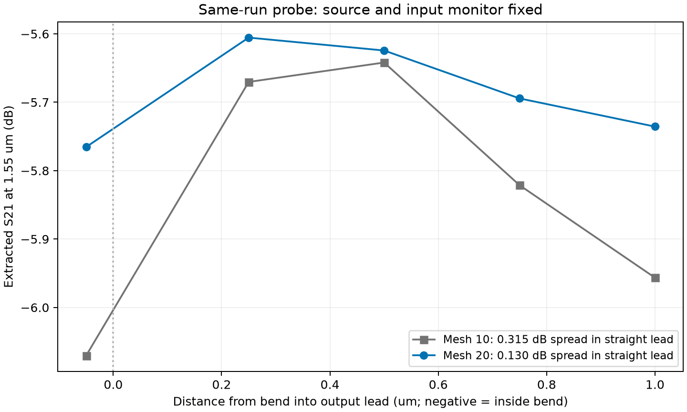

# README device validation on RTX 3090

> **Draft / merge blocked:** The updated BeamZ results are promising, with much
> better sharp S-bend accuracy and mesh-refinement behavior than the recorded
> 0.4.3 results, and working y-branch reverse paths. BeamZ
> [#309](https://github.com/beamzorg/beamz/issues/309) must be resolved and the
> affected benchmarks rerun before this migration is ready to merge.

On 2026-10-04, BeamZ 0.5.2 completed full S-matrix runs of the sharp S-bend,
three-port y-branch, and Si→SiN escalator on the local RTX 3090. The y-branch
forward split agrees with the recorded commercial engines within 0.05 dB;
the escalator forward transmission agrees within 0.09 dB. The sharp S-bend
improves substantially over BeamZ 0.4.3, but remains sensitive to monitor
position. This is reported in [BeamZ issue #309](https://github.com/beamzorg/beamz/issues/309)
with a standalone native BeamZ reproducer.

**Tidy3D and Lumerical were not rerun.** Their columns below use the existing
July 2026 recordings (Tidy3D 2.11.2 and Lumerical 2025 R2). No cloud credits
or licensed runs were used. Original reference artifacts remain unchanged.

## Transmission at 1.55 µm

Values are 20 log10 |S| in dB, interpolated in frequency where needed.
Times include preparation inside `run()`, compilation, all port excitations,
and modal extraction; they exclude plots. These are single-run timings.

| Device / path | BeamZ mesh | BeamZ 0.5.2 | Recorded Tidy3D | Recorded Lumerical | Full matrix run (s) |
|---|---:|---:|---:|---:|---:|
| Sharp S-bend S21 | 20 | -5.764 | -5.635 | -5.633 | 301.80 |
| Y-branch S21 | 10 | -3.170 | -3.204 | -3.202 | 178.47 |
| Y-branch S31 | 10 | -3.158 | -3.204 | -3.202 | same run |
| Si→SiN escalator S21 | 10 | +0.032 | +0.019 | -0.055 | 106.05 |



[Vector figure](results/devices/comparison.svg) ·
[Machine-readable summary](results/devices/summary.json)

The S-bend reference values are the finest available recorded meshes:
Tidy3D mesh 25 and Lumerical mesh 22. The historical BeamZ 0.4.3 mesh-20
result was about -1.99 dB. The new default result is much closer, but agreement
at a chosen monitor plane does not establish accuracy.

## Refinement and full-matrix checks

| Device | Mesh | S21 (dB) | Run (s) | Maximum complex reciprocity error |
|---|---:|---:|---:|---:|
| S-bend | 6 | -6.981 | 13.91 | 0.01919 |
| S-bend | 10 | -6.063 | 33.84 | 0.00503 |
| S-bend | 14 | -5.902 | 78.90 | 0.00254 |
| S-bend | 20 | -5.764 | 301.80 | 0.00267 |
| Y-branch | 6 | -3.437 | 44.99 | 0.02480 |
| Y-branch | 10 | -3.170 | 178.47 | 0.00319 |
| Escalator | 6 | +0.113 | 31.59 | 0.03641 |
| Escalator | 10 | +0.032 | 106.05 | 0.01382 |

All 18 excitations in these eight runs produced finite results and reached
BeamZ's temporal stopping criterion. This does **not** establish mesh convergence.
Reciprocity is max |Sij - Sji| across the sampled spectrum, within each run.

The mesh-10 y-branch has valid incident-power samples for all three sources.
Its reverse paths work: S12 = -3.135 dB and S13 = -3.125 dB at 1.55 µm.
The previously problematic third-port reverse column is populated. Forward
split agreement does not extend to every weak path: reflections and output-arm
coupling differ appreciably between engines, as the complete matrices show.
For example, BeamZ output-arm coupling is about -24 dB, versus -26.4 dB for
Tidy3D and -33.4 dB for Lumerical.



The escalator reverse path is -0.062 dB, versus -0.104 dB for Tidy3D and
-0.156 dB for Lumerical. Its maximum guided-power sum is 1.01037 (about 1%
above unity), down from 1.03219 at mesh 6. The small positive transmission
is numerical normalization error, not physical gain. The y-branch maximum
power sum is 0.96910 at mesh 10.

[Escalator matrices](results/devices/escalator_matrix.png) ·
[Y-branch field](results/devices/ybranch-mesh10/fields.png) ·
[Escalator field](results/devices/escalator-mesh10/fields.png) ·
[S-bend field](results/devices/sbend-mesh20/fields.png)

## Upstream S-bend investigation

A controlled probe places five output monitors in a **single simulation**,
with the source and input monitor fixed. The following samples are exactly
at 1.55 µm, unlike the interpolated main sweep above. Positive distance means
outward along the straight output lead; the first plane lies inside the bend.

| Distance from output port (µm) | Mesh 10 S21 (dB) | Mesh 20 S21 (dB) |
|---:|---:|---:|
| -0.05 | -6.070 | -5.765 |
| +0.25 | -5.670 | -5.605 |
| +0.50 | -5.642 | -5.624 |
| +0.75 | -5.821 | -5.694 |
| +1.00 | -5.956 | -5.736 |

Even excluding the plane inside the bend, transmission varies by **0.315 dB
at mesh 10** and **0.130 dB at mesh 20** along the uniform lead. Both runs
reach the temporal stopping criterion. These are multiple samples of the same
output, so their powers must not be summed as independent ports.



The cause remains unresolved: radiation, the finite monitor aperture, and
modal projection/discretization need upstream investigation. The native
reproducer matched all 15 mesh-10 magnitude samples within 0.000001 dB and
requires neither GDS_FDTD nor its layout dependencies. Raw directional modal
amplitudes, residuals, incident-power validity, geometry, and termination
statistics accompany [issue #309](https://github.com/beamzorg/beamz/issues/309).
The adapter's default monitor position was retained; a favorable diagnostic
plane was not substituted into the main comparison.

[Standalone reproducer](repro/beamz_plane_dependence.py) ·
[Exact native scene](repro/sbend_scene.json) ·
[Submitted issue body](repro/UPSTREAM_ISSUE.md) ·
[Native reproduction output](results/devices/native-plane-probe-mesh10.json)

## Reproduce and inspect

Use the CUDA environment described in [the integration report](README.md),
with BeamZ 0.5.2. The recorded environment used Python 3.12.13, JAX 0.10.2,
CUDA 12 packages, and NVIDIA driver 610.43.03 on a 24 GiB RTX 3090.
Install the y-branch layout dependency, then execute each benchmark artifact
in a fresh interpreter:

```bash
uv pip install 'beamz==0.5.2' 'siepic_ebeam_pdk==0.4.53'
JAX_PLATFORMS=cuda XLA_PYTHON_CLIENT_PREALLOCATE=false MPLBACKEND=Agg \
  .venv/bin/python benchmarks/beamz_devices.py sbend --mesh 20
JAX_PLATFORMS=cuda XLA_PYTHON_CLIENT_PREALLOCATE=false MPLBACKEND=Agg \
  .venv/bin/python benchmarks/beamz_devices.py ybranch --mesh 10
JAX_PLATFORMS=cuda XLA_PYTHON_CLIENT_PREALLOCATE=false MPLBACKEND=Agg \
  .venv/bin/python benchmarks/beamz_devices.py escalator --mesh 10
MPLBACKEND=Agg .venv/bin/python benchmarks/compare_beamz_devices.py
JAX_PLATFORMS=cuda XLA_PYTHON_CLIENT_PREALLOCATE=false MPLBACKEND=Agg \
  .venv/bin/python benchmarks/repro/beamz_plane_dependence.py --mesh 10 \
  --output /tmp/beamz-native-probe.json
```

Repeat the device commands at the meshes in the refinement table to reproduce
the whole sweep. `--build-only` performs offline preparation without GPU use.
Each device directory under `results/devices/` contains `setup.json` (geometry,
GDS SHA256, grid, ports and specification), `results.json`, `smatrix.npz`,
and saved fields. Later runs also retain raw `modal_opt*.npz` diagnostics.
The `sbend-plane-probe-mesh*` directories contain simultaneous-monitor probes;
`sbend-mesh10-offset*` are separate source/monitor-offset experiments excluded
from the primary mesh comparison.

Comparison limits: BeamZ uses a uniform mesh and constant material indices;
reference settings include different grids, dispersion, sidewall angles,
and monitor planes. The historical y-branch PDK revision was not recorded,
so its exact GDS hash cannot be confirmed against the current 0.4.53 layout.
These comparisons concern magnitudes, not cross-engine complex phase.
All saved field views are XY slices; the escalator slice at silicon-core
height does not directly visualize its vertical power transfer.
