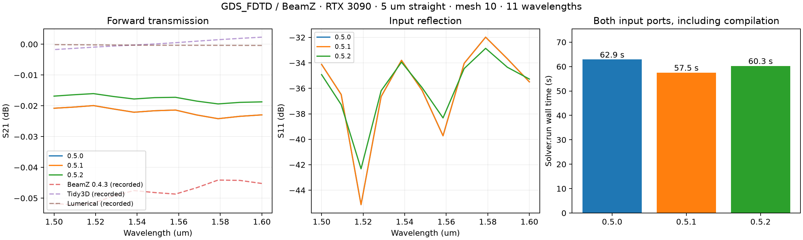

# BeamZ integration on the local RTX 3090

The adapter now requires BeamZ **>=0.5.3,<0.6**, with **0.5.3** locked as the latest
release checked on 2026-10-04 ([PyPI](https://pypi.org/project/beamz/0.5.3/)).
See the [0.5.3 verification report](BEAMZ_053_RESULTS.md) for the upstream
material-snapshot fix. The release comparison below preserves the original
0.5.0–0.5.2 measurements.
It uses immutable sources, ports, monitors, and detached simulation results.
Canonical GDS_FDTD polygons supply geometry for every frontend. Preparation
uses CPU rasterization; simulation construction and GPU execution occur in `run()`.

For the README devices, see [the S-bend, y-branch, and escalator report](DEVICE_RESULTS.md),
including full matrices, refinement sweeps, and upstream BeamZ issue #309.

## Reproduce

From the repository root:

```bash
uv sync --extra dev --extra beamz --extra gdsfactory
uv pip install 'jax[cuda12]'
JAX_PLATFORMS=cuda XLA_PYTHON_CLIENT_PREALLOCATE=false MPLBACKEND=Agg \
  .venv/bin/python benchmarks/beamz_integration.py --mesh 10 \
  --output benchmarks/results/latest
MPLBACKEND=Agg .venv/bin/python benchmarks/plot_beamz_results.py
```

The historical release matrix predates the 0.5.3 minimum. To reproduce it,
use commit `9679ac1`, then install each `beamz==0.5.0`, `beamz==0.5.1`, and
`beamz==0.5.2` using `uv pip install`, then run the benchmark in a fresh
interpreter with a distinct output directory. Use `.venv/bin/python` directly:
`uv run` may restore the locked version. The plot script reads the three
versioned `beamz-<version>-mesh10` directories. CUDA is required explicitly;
a missing CUDA backend fails rather than silently falling back to the CPU.

## Measurement

- NVIDIA GeForce RTX 3090, 24 GiB; driver 610.43.03. Each saved JSON includes
  the JAX version, device identity, and GPU utilization before the run.
- 5 µm straight, 0.5 µm wide and 0.22 µm thick silicon core, index 3.476;
  cladding index 1.444; `examples/tech.yaml`.
- Mesh 10: approximately 44.59 nm cells, 118 × 146 × 247 cells (4,255,316).
  Eleven wavelengths from 1.5 to 1.6 µm. Both input ports run separately.
- The first excitation records the XY electric-field plane. The result
  contains the complete two-port complex S-matrix, including reflection.
- `build_seconds` measures CPU preparation. `run_seconds` includes simulation
  setup, compilation, both FDTD runs, and modal extraction. Plotting and I/O
  are excluded. These are single application runs, not statistically robust
  throughput or speedup measurements. Compilation/raster caches and desktop
  activity can affect timings.
- Another GPU job was active during initial inspection; it finished before
  these measurements. It was not interrupted. Runs were sequential.

| BeamZ | Build (s) | Run (s) | S21 range (dB) | Maximum S11 (dB) | Max complex reciprocity error |
|---|---:|---:|---:|---:|---:|
| 0.5.0 | 0.99 | 62.89 | -0.02419 to -0.01993 | -31.98 | 0.00552 |
| 0.5.1 | 0.98 | 57.53 | -0.02419 to -0.01993 | -31.98 | 0.00556 |
| 0.5.2 | 0.96 | 60.28 | -0.01939 to -0.01605 | -32.86 | 0.00463 |

All six mesh-10 excitations reached the automatic decay stopping criterion.
The maximum guided-power sum on 0.5.2 was 1.005515 (0.55% numerical overshoot).
The latest S21 magnitude differs from historical Tidy3D by at most
**0.0210 dB**, Lumerical by **0.0190 dB**, and
BeamZ 0.4.3 by **0.0357 dB**. Historical magnitudes are linearly
interpolated in frequency onto the new frequency grid before subtraction.

The latest coarse mesh-5 run took 16.82 s, with S21 from
0.0156 to 0.0478 dB and maximum S11
-30.62 dB. Both excitations converged. The finer mesh is needed
for reliable near-unity transmission estimates.




[Latest field plot](results/beamz-0.5.2-mesh10/fields.png) ·
[Latest raw results](results/beamz-0.5.2-mesh10/results.json) ·
[Latest S-matrix](results/beamz-0.5.2-mesh10/smatrix.npz)

The historical Tidy3D/Lumerical/BeamZ 0.4.3 datasets are replayed from
`tests/recorded/straight_mesh10_*.npz`; those engines were **not rerun**.
Their original recordings are unchanged. No cloud credits or licensed
solvers were used.

The adapter remains limited to fundamental TE and x-facing ports. Multilayer
geometry is covered by offline raster tests and the separate
[device validation report](DEVICE_RESULTS.md); this release matrix validates
the straight-waveguide case. Slight power sums above one
are numerical normalization error, not physical gain. BeamZ 0.5.0/0.5.1 issue
an absorber-normal material-variation warning on this geometry; the raw
transmission/reflection and convergence checks are reported without suppressing it.

## Numerical scope and checks

The BeamZ 0.5 adapter puts each source in its uniform port extension and uses
a fixed monitor plane for every excitation column. This differs from the old
adapter's moving input-monitor plane; historical comparisons above concern
**transmission magnitude**, not complex phase at identical reference planes.

The 2 µm real-engine regression needs mesh 6 on BeamZ 0.5.2: at mesh 5 its
maximum complex reciprocity error is approximately 0.060, above the existing
0.05 tolerance; mesh 6 reduces it to approximately 0.013. The test's tolerance
was retained. This is a resolution limitation, so mesh convergence remains
necessary for quantitative designs. The default 5 µm benchmark additionally
records the latest version at mesh 5 as a coarse-grid comparison.

Offline tests cover multilayer rasterization, larger domain margins,
unsupported API versions, and CPU-only preparation with JAX device access
forbidden. The real-engine test covers transmission, reflection, reciprocity,
power balance, convergence, both field-plot scales, and cache round-trip.

Final checks: 368 offline tests passed (27 optional-engine skips), plus the
real GPU end-to-end test passed. The 0.5.0 and 0.5.1 adapter/conformance suites
each passed 44 tests (9 optional-engine skips). Ruff lint, formatting of changed
files, codespell, lock consistency, and strict mypy over all 35 source files pass.
The original check found baseline formatting failures in `HANDOFF.md`,
`docs/adding_a_solver.md`, and `docs/remote_compute.md`. Subsequent upstream
maintenance fixes these; after merging it into this PR, all repository-wide
formatting checks pass and the test suite passes 372 tests (27 skips).
