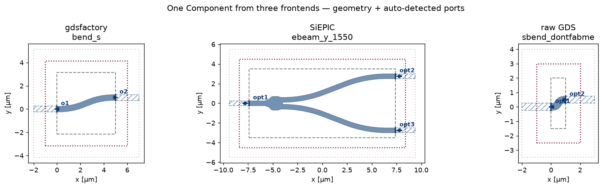

Layout Frontends
================

A **frontend** is the layer that turns a *layout*, however you drew it, into
the engine-agnostic :class:`~gds_fdtd.geometry.Component` that every solver
consumes. It reads the polygons on each technology layer, extrudes them to the
z-heights and materials the :doc:`technology` defines, and **auto-detects the
ports** from the layout's pin/DevRec conventions.

.. code-block:: text

    layout source                       frontend                     Component
    ─────────────                       ────────                     ─────────
    gdsfactory component  ─────▶  layout.gdsfactory.from_gdsfactory  ─┐
    SiEPIC / KLayout cell ─────▶  lyprocessor.load_cell              ─┤─▶  Component  ─▶  get_solver(...)
    raw .gds (any tool)   ─────▶      + load_component_from_tech     ─┤       (polygons +
    litho-predicted .gds  ─────▶  lyprocessor.load_device (PreFab)   ─┘        ports + bounds)

The Component is the boundary: **your frontend choice and your engine choice are
independent.** The same y-branch reaches beamz, tidy3d, and Lumerical whether it
came from gdsfactory or a foundry PDK; conversely one frontend feeds every
engine. The worked example is :doc:`_notebooks/08_frontends`.

   One ``Component``, three frontends. Each device carries device polygons,
   auto-detected ports (arrows), the DevRec bounds, and, given a
   ``SimulationSpec``, the FDTD region. Downstream everything is identical.

Built-in frontends
------------------

gdsfactory
^^^^^^^^^^

`gdsfactory <https://gdsfactory.github.io/gdsfactory/>`_ (>= 9) builds
components parametrically in Python. :func:`~gds_fdtd.layout.gdsfactory.from_gdsfactory`
reads the polygons on each technology layer and lifts the gdsfactory ports into
gds_fdtd ports:

.. code-block:: python

    import gdsfactory as gf
    from gds_fdtd.layout.gdsfactory import from_gdsfactory
    from gds_fdtd.technology import Technology

    tech = Technology.from_yaml("tech.yaml")
    gf.gpdk.PDK.activate()
    component = from_gdsfactory(gf.components.mmi1x2(), tech)

SiEPIC / KLayout
^^^^^^^^^^^^^^^^

A cell from a KLayout/SiEPIC foundry PDK, the path most silicon-photonics
tapeouts use. :func:`~gds_fdtd.lyprocessor.load_cell` opens the layout;
:func:`~gds_fdtd.simprocessor.load_component_from_tech` extrudes it against the
technology. Ports come from the SiEPIC pin + DevRec layers:

.. code-block:: python

    import os
    import siepic_ebeam_pdk as pdk
    from gds_fdtd.lyprocessor import load_cell
    from gds_fdtd.simprocessor import load_component_from_tech

    gds = os.path.join(os.path.dirname(pdk.__file__), "gds", "EBeam", "ebeam_y_1550.gds")
    cell, layout = load_cell(gds, top_cell="ebeam_y_1550")
    component = load_component_from_tech(cell=cell, tech=tech)

Raw GDS
^^^^^^^

No PDK, no framework, any ``.gds`` from any tool. As long as its polygons land
on the technology's device / pin / DevRec layers, ports are detected the same
way:

.. code-block:: python

    cell, layout = load_cell("my_layout.gds", top_cell="my_cell")
    component = load_component_from_tech(cell=cell, tech=tech)

PreFab (lithography prediction)
^^^^^^^^^^^^^^^^^^^^^^^^^^^^^^^^

`PreFab <https://www.prefabphotonics.com/>`_ predicts how a nanofabrication
process will actually print your design (corner rounding, proximity effects).
:func:`~gds_fdtd.lyprocessor.load_device` runs the model, writes a
``<cell>_predicted.gds``, and loads it like any other GDS, so the litho-predicted
shape flows through the identical path (needs a PreFab account):

.. code-block:: python

    from gds_fdtd.lyprocessor import load_device

    predicted = load_device(
        "my_design.gds", tech=tech, top_cell="my_cell",
        prefab_model="ANT_NanoSOI_ANF1_d10", output_dir="out/",
    )

What every frontend produces
----------------------------

A frontend's only job is to return a :class:`~gds_fdtd.geometry.Component` with
three things:

``structures``
    A flat list of :class:`~gds_fdtd.geometry.Structure`, each a 2-D polygon
    extruded in z, tagged by **role**: ``"device"`` (your patterned layers),
    ``"substrate"``, and ``"superstrate"`` (the backgrounds, filled from the
    technology). Each carries its GDS ``layer``, z-extent, and the resolved
    ``material``.

``ports``
    A list of :class:`~gds_fdtd.geometry.Port`, each with a name, µm ``center``
    ``[x, y, z]``, ``width``, and a snapped ``direction`` (0/90/180/270°). These
    are where the solver launches and collects modes.

``bounds``
    A :class:`~gds_fdtd.geometry.Region`, the simulation extent (from the DevRec
    layer for the GDS frontends).

Write your own frontend
-----------------------

To support a tool that is not listed above (a different layout library, a
procedural generator, an in-house format), write a function that produces the
three objects above. The two reference implementations to copy are
:func:`~gds_fdtd.simprocessor.load_component_from_tech` and
:func:`~gds_fdtd.layout.gdsfactory.from_gdsfactory`.

The example below builds a 5 µm straight waveguide entirely by hand, no GDS, no
layout library, and it runs on any engine. It uses the technology's own
z-heights and materials (via :meth:`~gds_fdtd.technology.Technology.to_solver_dict`)
so a custom frontend needs to supply only the polygons and ports:

.. code-block:: python

    from gds_fdtd.geometry import Component, Port, Region, Structure
    from gds_fdtd.technology import Technology
    from gds_fdtd.solvers import get_solver
    from gds_fdtd.spec import SimulationSpec

    tech = Technology.from_yaml("tech.yaml")
    layers = tech.to_solver_dict()          # device / substrate / superstrate as dicts
    dev, sub, sup = layers["device"][0], layers["substrate"][0], layers["superstrate"][0]

    z_center = dev["z_base"] + dev["z_span"] / 2
    background = [[-2.0, -3.0], [7.0, -3.0], [7.0, 3.0], [-2.0, 3.0]]
    core = [[0.0, -0.25], [5.0, -0.25], [5.0, 0.25], [0.0, 0.25]]   # 5 x 0.5 um strip

    structures = [
        Structure(name="core", polygon=core, z_base=dev["z_base"], z_span=dev["z_span"],
                  material=dev["material"], layer=list(dev["layer"])),        # role="device" (default)
        Structure(name="sub", polygon=background, z_base=sub["z_base"], z_span=sub["z_span"],
                  material=sub["material"], role="substrate"),
        Structure(name="sup", polygon=background, z_base=sup["z_base"], z_span=sup["z_span"],
                  material=sup["material"], role="superstrate"),
    ]
    ports = [
        Port(name="opt1", center=[0.0, 0.0, z_center], width=0.5, direction=180),
        Port(name="opt2", center=[5.0, 0.0, z_center], width=0.5, direction=0),
    ]
    component = Component(name="hand_built", structures=structures, ports=ports,
                          bounds=Region(vertices=background, z_center=z_center, z_span=2.0))

    solver = get_solver("beamz")(component, tech, SimulationSpec(mesh=5, z_min=-1.0, z_max=1.11))
    assert solver.validate() == []          # runs like any other Component

The ``material`` passed to each ``Structure`` is the neutral material mapping the
technology resolves (constant ``nk``, a ``rii`` reference, or engine hints); the
solver picks the right optical-constant source per engine, see :doc:`technology`.

.. seealso::

   - :doc:`_notebooks/08_frontends`, the same three frontends, executed, plus
     the full frontend × engine matrix.
   - :doc:`technology`, the layer stack and materials each frontend extrudes
     against.
   - :mod:`gds_fdtd.geometry`, the ``Component`` / ``Structure`` / ``Port`` API.
