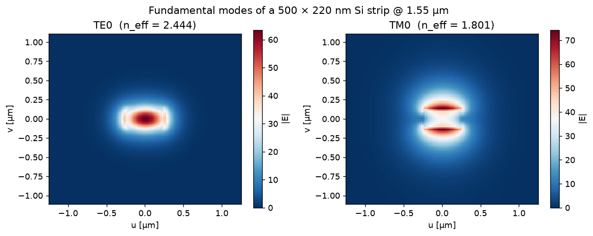
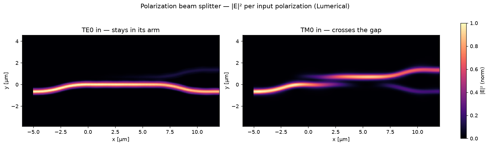

Multi-Modal Simulations
=======================

Multi-modal simulations track several waveguide modes, typically TE
(mode 1) and TM (mode 2), through one device: polarization-dependent
loss, mode conversion, and polarization-insensitive design all need them.

Enable with one field
---------------------

.. code-block:: python

    from gds_fdtd.spec import SimulationSpec
    from gds_fdtd.solvers import get_solver

    spec = SimulationSpec(modes=(1, 2), wavelength_points=51, z_min=-1.0, z_max=1.11)
    solver = get_solver("tidy3d")(component, technology=tech, spec=spec)
    smatrix = solver.run()

Mode ids are 1-based package-wide: mode 1 = fundamental TE-like, mode 2 =
TM-like. tidy3d and Lumerical support multimode; beamz v1 is single-mode
TE (its ``capabilities.supports_multimode`` says so and ``validate()``
rejects multi-mode jobs).

   The two modes a multi-mode job tracks, from the local mode solver: TE0 (E
   in-plane, tightly confined) and TM0 (E vertical, lower index, less confined).
   The confinement difference is what polarization devices exploit.

Reading a multi-mode S-matrix
-----------------------------

Every path is indexed by (out_port, in_port, out_mode, in_mode):

.. code-block:: python

    thru_te = smatrix.magnitude_db(out="opt4", in_="opt1", mode_out=1, mode_in=1)
    thru_tm = smatrix.magnitude_db(out="opt4", in_="opt1", mode_out=2, mode_in=2)
    conversion = smatrix.magnitude_db(out="opt4", in_="opt1", mode_out=2, mode_in=1)

    # polarization-dependent loss across the band
    pdl_db = abs(thru_te - thru_tm)

Curated plotting, mode-preserving paths only (conversion terms of a
symmetric device sit at the noise floor and only clutter the plot):

.. code-block:: python

    from gds_fdtd.plotting import plot_smatrix

    paths = [
        ("opt4", "opt1", 1, 1), ("opt4", "opt1", 2, 2),  # thru TE / TM
        ("opt1", "opt1", 1, 1), ("opt1", "opt1", 2, 2),  # reflection TE / TM
    ]
    plot_smatrix(smatrix, kind="db", paths=paths)

By default ``plot_smatrix`` hides paths whose peak is below −60 dB, so a
full 4-port × 2-mode matrix (64 paths) stays readable.

Physics checks work per mode-flattened matrix:

.. code-block:: python

    smatrix.is_reciprocal()   # S == S^T over (port, mode) pairs
    smatrix.is_passive()      # no excitation outputs more power than it got

Exports carry modes too: ``to_dat()`` writes per-mode entries INTERCONNECT
understands, and ``to_touchstone()`` flattens (port, mode) pairs port-major
(the convention is written into the file header).

Polarization devices
--------------------

Multi-mode S-parameters are how you design and verify polarization components.
A directional coupler, for instance, transfers TM across its gap far faster than
TE, so one length routes the two polarizations to different ports:

   A polarization beam splitter: with a TE0 input the field stays in its arm;
   with TM0 it crosses the gap. Worked end to end (splitter and
   splitter-rotator) in :doc:`_notebooks/10b_polarization`.

Symmetry can halve multi-mode cost
----------------------------------

For z-symmetric stacks, ``symmetry=(0, 0, 1)`` selects TE-like modes and
``(0, 0, -1)`` TM-like; check your stack really is symmetric before using
it (the crossing example runs with no symmetry for exactly that reason).
