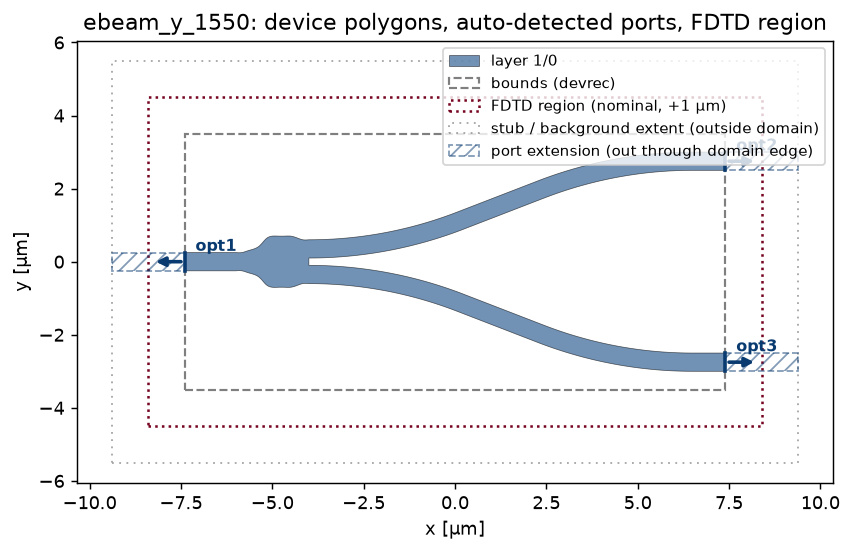
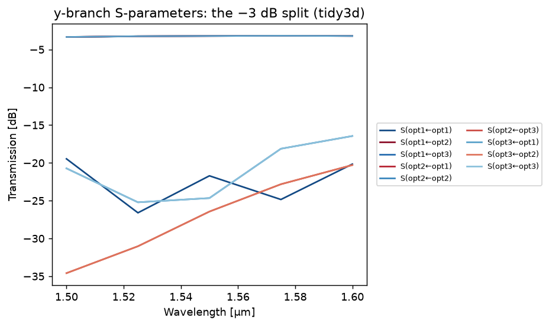

Setting Up Simulations
======================

From a GDS layout to S-parameters in four steps, on any engine.

1. Load the layout
------------------

.. code-block:: python

    from gds_fdtd.technology import Technology
    from gds_fdtd.lyprocessor import load_cell
    from gds_fdtd.simprocessor import load_component_from_tech

    tech = Technology.from_yaml("examples/tech.yaml")
    cell, layout = load_cell("examples/devices.gds", top_cell="crossing_te1550")
    component = load_component_from_tech(cell=cell, tech=tech)

Ports are auto-detected from the SiEPIC pin convention (never hand-placed).
gdsfactory (>= 9) components convert directly:

.. code-block:: python

    import gdsfactory as gf
    from gds_fdtd.layout.gdsfactory import from_gdsfactory

    gf.gpdk.PDK.activate()
    component = from_gdsfactory(gf.components.straight(length=5), tech)

``plot_component(component, spec=spec)`` shows what you loaded, device polygons,
the auto-detected ports, the DevRec bounds, and the FDTD region:

2. Configure with SimulationSpec
--------------------------------

Every numeric setting lives in one validated model (lengths in µm, angles
in degrees, frequencies in Hz, package-wide):

.. code-block:: python

    from gds_fdtd.spec import SimulationSpec

    spec = SimulationSpec(
        wavelength_start=1.5,
        wavelength_end=1.6,
        wavelength_points=51,
        mesh=10,                      # grid cells per wavelength
        boundary=("PML", "PML", "Metal"),
        symmetry=(0, 0, 0),
        z_min=-1.0,
        z_max=1.11,
        modes=(1, 2),                 # TE + TM
        field_monitors=("z",),
    )

Bad values fail loudly at construction with the offending field named.

Field monitors are steerable: one plane per axis in ``field_monitors``
(``"z"`` top view, ``"y"``/``"x"`` side views), each sitting at the domain
center (x/y) or the device layers' average mid-plane (z) unless
``field_monitor_positions`` pins it to an absolute coordinate. On tidy3d,
``field_monitor_wavelengths`` restricts what the monitors record, so a dense
S-parameter spectrum does not force an equally dense field download. See
where every plane sits before running anything:

.. code-block:: python

    spec = SimulationSpec(
        field_monitors=("y", "z"),
        field_monitor_positions={"z": 0.11},      # pin to the Si-core mid-plane
        field_monitor_wavelengths=(1.545, 1.59),  # record just these [um]
    )

    from gds_fdtd.plotting import plot_monitor_planes
    plot_monitor_planes(solver)   # offline: domain, layers, every plane labelled

:doc:`_notebooks/05b_field_monitors` walks through the placement machinery on
the Si→SiN escalator, and :doc:`_notebooks/11_bragg_grating` uses the
wavelength selection to watch one device reflect in-band and transmit
out-of-band from a single run.

3. Validate, build, estimate, all free
---------------------------------------

.. code-block:: python

    from gds_fdtd.solvers import get_solver

    solver = get_solver("tidy3d")(component, technology=tech, spec=spec)
    print(solver.describe())
    assert solver.validate() == []
    artifacts = solver.build()       # offline: full native scene / setup script
    print(solver.estimate())

Nothing so far cost anything: no cloud tasks, no license checkout.

4. Run and analyze
------------------

.. code-block:: python

    smatrix = solver.run()                        # the only spending step
    smatrix.is_reciprocal(), smatrix.is_passive() # physics checks
    smatrix.to_dat("device.dat")                  # -> INTERCONNECT
    smatrix.to_touchstone("device.s4p")           # -> scikit-rf & friends

    from gds_fdtd.plotting import plot_smatrix
    plot_smatrix(smatrix, kind="db")
    solver.plot_fields(axis="z")

   ``plot_smatrix``, every measured path in dB. This y-branch splits its input
   near −3 dB into each arm.

.. figure:: images/ybranch_field.png
   :width: 85%
   :align: center

   ``solver.plot_fields(axis="z")``, the ``|E|²`` field in the device plane,
   the mode splitting one input into two.

Choosing the mesh
-----------------

Sweep the mesh and let the S-matrix convergence decide. With a cache directory,
repeating a sweep never re-spends:

.. code-block:: python

    from gds_fdtd.convergence import sweep

    report = sweep(get_solver("tidy3d"), component, tech, spec,
                   field="mesh", values=[6, 8, 10], cache_dir=".gds_fdtd_cache")
    print(report.summary())
    report.recommend(tol_db=0.05)    # first value that moved < 0.05 dB

Ship it anywhere
----------------

A simulation is a serializable job; any machine with the package is a
worker (see :doc:`remote_compute`):

.. code-block:: bash

    gds-fdtd validate job.json
    gds-fdtd estimate job.json
    gds-fdtd run job.json --out results/

Budgets (``max_flexcredits`` / ``max_wall_seconds``) are enforced before
and during the run; secrets come from the environment only.
