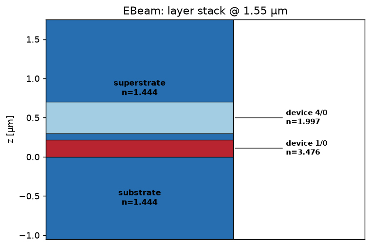
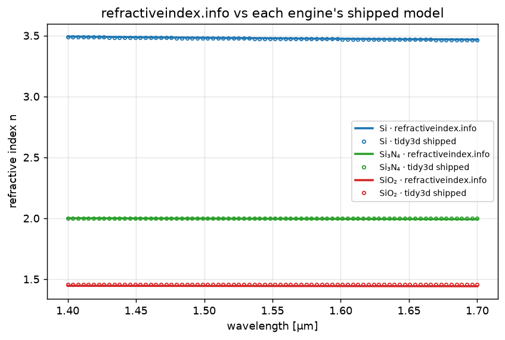
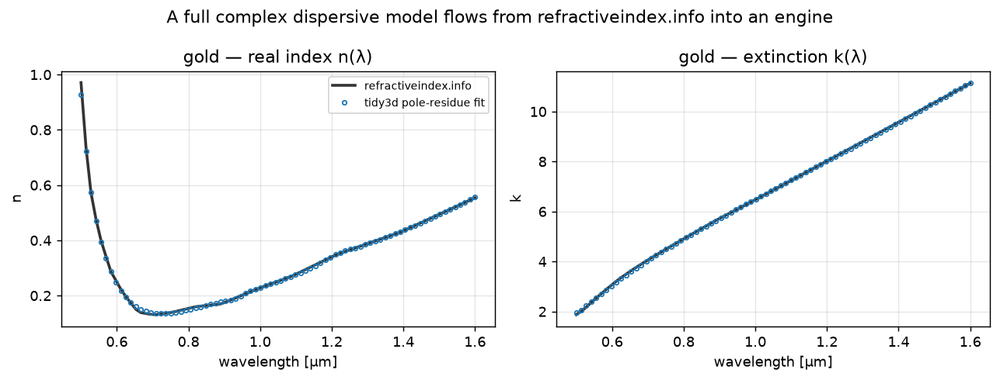
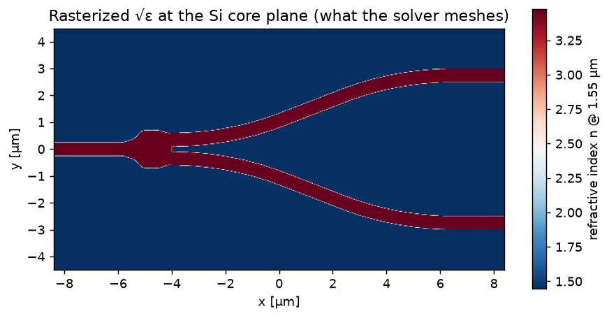

Technology and Materials
========================

A **technology** is the other half of a simulation (the :doc:`layout <frontends>`
is the first half): the **vertical layer stack** and the **material** on each
layer. One pydantic-validated YAML file serves every engine, the frontend
extrudes your polygons against it, and each solver reads the material it needs
from the same definition.

   The layer stack of ``examples/tech.yaml``: a silicon core on an oxide
   substrate, clad in oxide. ``plot_tech_stack(tech)`` draws it from the file.

The technology file
-------------------

Define each material once and reference it by name; layers place those materials
in ``z``:

.. code-block:: yaml

    technology:
      name: "EBeam"
      schema_version: 2

      materials:
        Si:
          nk: 3.476                        # neutral constant (beamz, grid/modes)
          tidy3d: [cSi, Li1993_293K]       # tidy3d's dispersive model
          lumerical: Si (Silicon) - Palik  # Lumerical's dispersive model
        SiO2:
          nk: 1.444
          tidy3d: 1.444
          lumerical: SiO2 (Glass) - Palik

      substrate:   {z_base: 0.0, z_span: -2, material: SiO2}
      superstrate: {z_base: 0.0, z_span: 3,  material: SiO2}
      pinrec: [{layer: [1, 10]}]           # port pins
      devrec: [{layer: [68, 0]}]           # device region (simulation bounds)
      device:
        - {layer: [1, 0], z_base: 0.0, z_span: 0.22, material: Si, sidewall_angle: 85}

``examples/tech.yaml`` is the reference file. Load it with
:meth:`Technology.from_yaml <gds_fdtd.technology.Technology.from_yaml>`:

.. code-block:: python

    from gds_fdtd.technology import Technology

    tech = Technology.from_yaml("examples/tech.yaml")
    print(tech.name, "-", len(tech.device), "device layer(s)")

Bad values fail at load with the offending key named.

.. _material-sources:

Materials: three sources of optical constants
---------------------------------------------

This is where accuracy is won or lost. A material may name up to **three**
sources of optical constants, and each engine picks exactly one at run time, so
the *same* material serves every solver:

.. list-table::
   :header-rows: 1
   :widths: 12 52 24

   * - source
     - what it is (tech-file key)
     - engines
   * - ``eda``
     - the engine's *own* database model, ``tidy3d:`` / ``lumerical:`` in the
       tech file. Dispersive and vendor-maintained.
     - tidy3d, Lumerical
   * - ``rii``
     - a `refractiveindex.info <https://refractiveindex.info>`_ page (``rii:``).
       Dispersive, engine-independent, measured.
     - all three
   * - ``nk``
     - a single constant index (``nk:``).
     - all three

You do **not** have to specify all three. A material with only ``tidy3d`` and
``lumerical`` gets each vendor's dispersive model; add ``rii`` for one measured,
engine-independent model across all engines, or just ``nk`` for a quick
constant.

   The engines' shipped models (markers) sit on the refractiveindex.info data
   (lines) for Si, Si₃N₄, and SiO₂, so an ``rii`` source and an ``eda`` source
   agree to a few parts in ten-thousand. Reproduced in
   :doc:`_notebooks/02_technology`.

Which source each engine uses
^^^^^^^^^^^^^^^^^^^^^^^^^^^^^^

1. If the material sets ``source:`` explicitly (``eda`` / ``rii`` / ``nk``),
   that source is used, and it is an **error** if that source is not defined for
   the engine you are running.
2. Otherwise the precedence is **eda → rii → nk**: the first one defined (and
   applicable to the engine) wins.
3. If none applies, a clear
   :class:`~gds_fdtd.errors.MaterialSourceError` is raised, for example a
   Lumerical-only technology run on tidy3d.

``beamz`` has no vendor material database, so its ``eda`` slot is always empty;
it uses ``rii`` (if present) or ``nk``.

.. code-block:: yaml

    materials:
      Si:
        nk: 3.476                            # constant fallback (and beamz)
        tidy3d: [cSi, Li1993_293K]           # tidy3d's own dispersive model
        lumerical: Si (Silicon) - Palik      # Lumerical's own dispersive model
        rii: {shelf: main, book: Si, page: Salzberg}   # refractiveindex.info
        source: rii     # OPTIONAL: force every engine to use the rii model
                        # (omit -> tidy3d/Lumerical use their model, beamz uses rii)

How each engine applies the chosen source:

- **tidy3d**: ``eda`` and ``rii`` both become *dispersive* media (``rii`` is
  fitted to a pole-residue medium via
  :meth:`~gds_fdtd.materials.rii.RiiMaterial.to_tidy3d_medium`); ``nk`` becomes a
  constant ``td.Medium``.
- **Lumerical**: ``eda`` is the vendor database name (its own dispersion);
  ``rii`` / ``nk`` are emitted as an ``(n, k)`` material in the ``.lsf``.
- **beamz**: a single constant index from ``rii`` (sampled at band center) or
  ``nk``.

Using refractiveindex.info directly
^^^^^^^^^^^^^^^^^^^^^^^^^^^^^^^^^^^^^

The point of ``rii`` is that one measured model, its full complex
``n(λ) + i·k(λ)``, flows into every engine intact. ``rii`` pages are read
**offline** from a local copy of the refractiveindex.info database; point
``GDS_FDTD_RII_DB`` at its ``data`` directory (or pass ``db_dir=``):

.. code-block:: python

    from gds_fdtd.materials.rii import load_rii_material

    au = load_rii_material("main", "Au", "Johnson")   # strongly dispersive + lossy
    medium = au.to_tidy3d_medium()                    # -> a dispersive td.Medium
    n, k = au.n_at(1.55), au.k_at(1.55)

   A measured gold model from refractiveindex.info (lines) and its tidy3d
   pole-residue fit (markers), across the full complex dispersion. Reproduced in
   :doc:`_notebooks/02b_rii_to_engines`.

.. admonition:: The Si₃N₄ trap

   A material name is not one number. "Si₃N₄" spans a family: LPCVD
   stoichiometric nitride sits near ``n ≈ 2.0``, while higher-nitrogen PECVD
   films run ~0.4 higher. Match the *variant* to your fab, not just the formula.

Layers
------

Each layer places a material in ``z`` (µm), with positive ``z_span`` growing up
and negative growing down.

.. list-table::
   :header-rows: 1
   :widths: 16 84

   * - key
     - meaning
   * - ``device``
     - a **list** of patterned layers, each ``{layer: [n, d], z_base, z_span,
       material, sidewall_angle}``. Multiple entries make a multi-layer stack
       (e.g. the Si→SiN escalator in :doc:`_notebooks/10_cookbook`).
   * - ``substrate`` / ``superstrate``
     - the backgrounds below and above the device, filled by the technology (not
       the GDS): ``{z_base, z_span, material}``.
   * - ``pinrec``
     - the GDS layer(s) carrying the port pins, where ports are detected.
   * - ``devrec``
     - the GDS layer marking the device region; its bounding box sets the
       simulation extent.

The frontend rasterizes these into the permittivity grid the solver integrates:

   ``plot_permittivity(component, axis="z", position=0.11)``, the √ε map at the
   Si core plane. This is the most useful FDTD sanity check: is the meshed
   structure the one you intended?

Loading and using a technology
------------------------------

.. code-block:: python

    tech = Technology.from_yaml("examples/tech.yaml")

    # inspect
    tech.name, tech.device[0].z_span, tech.superstrate.material

    # the plain-dict form the engine adapters consume (layers + resolved materials)
    layers = tech.to_solver_dict()

    # visualize the stack straight from the file (offline)
    from gds_fdtd.plotting import plot_tech_stack
    plot_tech_stack(tech, wavelength_um=1.55)

Migrating a schema-v1 file
^^^^^^^^^^^^^^^^^^^^^^^^^^^

Older files used per-layer inline materials (schema v1). Convert one to the
named-material v2 form with the CLI (the two schemas are equivalent, v2 expands
into v1 before validation):

.. code-block:: bash

    gds-fdtd convert-tech old.yaml -o tech.yaml

Common issues
-------------

**MaterialSourceError at run.**
   The engine you ran has no usable source for a material, e.g. a
   Lumerical-only technology run on tidy3d. Add an ``nk`` or ``rii`` fallback, or
   the missing ``tidy3d:`` / ``lumerical:`` entry.

**Ports not detected.**
   Check that the layout's pins land on the ``pinrec`` layer and the device
   region on ``devrec``. Ports come from those layers; see :doc:`frontends`.

**Structure looks wrong in the field.**
   Plot ``plot_permittivity`` before running. Wrong ``z_base`` / ``z_span`` sign
   (up vs down) or a GDS ``layer`` that doesn't match the file are the usual
   causes.

.. seealso::

   - :doc:`_notebooks/02_technology` and :doc:`_notebooks/02b_rii_to_engines` ,
     the executed materials notebooks.
   - :mod:`gds_fdtd.technology`, :mod:`gds_fdtd.materials.rii`,
     :mod:`gds_fdtd.materials.select`, the API.
   - :doc:`frontends`, how a layout is extruded against this technology.
